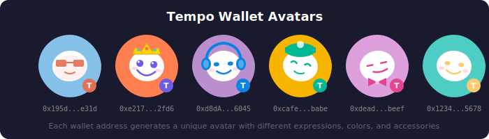

# Tempo Wallet Avatars

A deterministic avatar system that generates unique, friendly avatars for every wallet address on Tempo.



## Concept

Every Tempo wallet gets a unique avatar based on its address. The avatar is a friendly character we call **"Tempo"** — a musical note-inspired mascot that represents the fast, rhythmic nature of the Tempo blockchain.

## How It Works

Avatar traits are derived deterministically from the wallet address:

| Trait | Source | Options |
|-------|--------|---------|
| **Background Color** | Bytes 0-1 | 16 vibrant colors |
| **Body Color** | Bytes 2-3 | 8 accent colors |
| **Expression** | Bytes 4-5 | Happy, Cool, Chill, Excited, Zen |
| **Accessory** | Bytes 6-7 | None, Hat, Headphones, Sunglasses, Crown, Bowtie |
| **Rotation** | Bytes 8-9 | -15° to +15° tilt |

This means:
- The same address always generates the same avatar
- Each address has a unique combination (with billions of possible combinations)
- No storage required — avatars are generated on-the-fly

## Expressions

| Expression | Description |
|------------|-------------|
| **Happy** | Curved eyes with a big smile |
| **Cool** | Relaxed line eyes with a smirk |
| **Chill** | Half-closed eyes with a content expression |
| **Excited** | Wide open eyes with sparkles and a huge grin |
| **Zen** | Peacefully closed eyes with a gentle smile |

## Accessories

| Accessory | Description |
|-----------|-------------|
| **None** | Clean look, no accessories |
| **Hat** | Cozy beanie with a pom-pom |
| **Headphones** | Over-ear headphones (music theme!) |
| **Sunglasses** | Cool shades |
| **Crown** | Royal crown with jewels |
| **Bowtie** | Fancy bowtie at the bottom |

## Usage

```tsx
import { Avatar } from '#comps/Avatar'

// Basic usage
<Avatar address="0x1234...5678" />

// With custom size
<Avatar address="0x1234...5678" size={48} />

// With className
<Avatar address="0x1234...5678" className="border-2 border-white" />
```

## Where Avatars Appear

1. **Profile Header** — Large avatar next to wallet balance
2. **Transaction History** — Small avatars next to sender/receiver addresses
3. **Activity Feed** — Identify counterparties at a glance

## Design Principles

1. **Deterministic**: Same address = same avatar, always
2. **Memorable**: Unique enough to recognize at a glance
3. **Friendly**: Approachable, non-threatening characters
4. **Scalable**: Looks good from 18px to 200px+
5. **Branded**: Small "T" badge maintains Tempo identity

## Sample Avatars

| Address | Avatar |
|---------|--------|
| `0x195d...e31d` |  |
| `0xe217...2fd6` |  |
| `0xd8dA...6045` |  |
| `0xcafe...babe` |  |
| `0xdead...beef` |  |
| `0x1234...5678` |  |

## Generating Samples

```bash
node --experimental-strip-types scripts/generate-avatar-samples.ts
```
